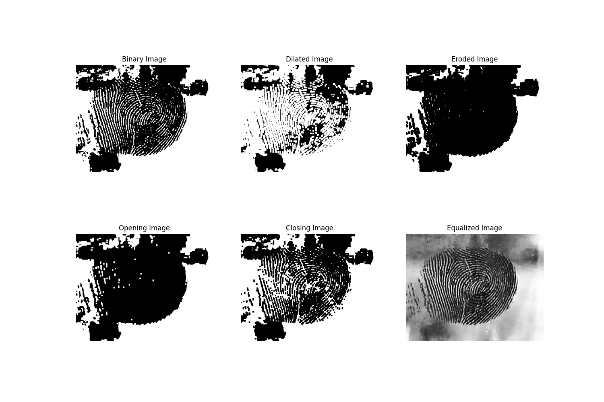

# Latent Fingerprint Image Preprocessing with OpenCV

This project demonstrates the use of classical image preprocessing techniques to enhance and isolate latent fingerprints from images captured on reflective surfaces. The goal is to explore how fundamental computer vision methods can reveal useful structural details in low-contrast or noisy images—an essential task in several real-world applications.

## Project Overview

We process three fingerprint images captured from the following surfaces:

- A drinking glass
- A glass cup
- A pair of sunglasses

For each image, the following steps are applied:

1. **Grayscale Conversion** – Ensures consistent processing.
2. **Histogram Equalization** – Enhances contrast to highlight fingerprint ridges.
3. **Binary Thresholding** – Segments the fingerprint into foreground and background.
4. **Morphological Operations**:
   - **Dilation** – Expands bright regions to reinforce ridges.
   - **Erosion** – Shrinks bright regions to eliminate small noise.
   - **Opening** – Erosion followed by dilation to remove small noise artifacts.
   - **Closing** – Dilation followed by erosion to fill small holes in ridge patterns.

All intermediate and final results are visualized side-by-side for comparison.

## Applications in Industry

Image preprocessing techniques such as these are widely used across many industries:

- **Forensic Science**: Enhancement of latent fingerprints from crime scene evidence.
- **Biometrics and Identity Verification**: Improving fingerprint quality for authentication systems.
- **Quality Assurance in Manufacturing**: Detecting surface defects, scratches, or pattern inconsistencies.
- **Medical Imaging**: Preprocessing MRI, CT, or X-ray images for clearer segmentation of tissues or anomalies.
- **Cultural Heritage and Restoration**: Revealing faded inscriptions or patterns on ancient artifacts.

## Sample Input and Output

### Original Input Images

| Glass Fingerprint | Glass Cup Fingerprint | Sunglasses Fingerprint |
|-------------------|-----------------------|------------------------|
|  |  |  |

### Processed Output Images (Morphological Analysis)

| Glass - Processed | Glass Cup - Processed | Sunglasses - Processed |
|-------------------|-----------------------|-------------------------|
|  |  |  |

## Implementation Details

This project was implemented using:

- **Language**: Python
- **Libraries**: OpenCV, NumPy, Matplotlib

Each image is processed individually using the same pipeline, and results are saved for further review. The side-by-side visual comparison enables a qualitative assessment of how each operation impacts the visibility and clarity of the fingerprint structure.

## Future Improvements

To further enhance performance and generalization:

- **CLAHE (Contrast Limited Adaptive Histogram Equalization)** could be used instead of global histogram equalization to adapt to local contrast changes.
- **Adaptive Thresholding** might outperform fixed thresholding for images with uneven lighting or varying background conditions.
- **Noise Estimation and Dynamic Kernel Tuning** could allow for automatic adjustment of morphological parameters based on image content.

---

## Created By

**Eric Ramirez**  
AI & Computer Vision Enthusiast
